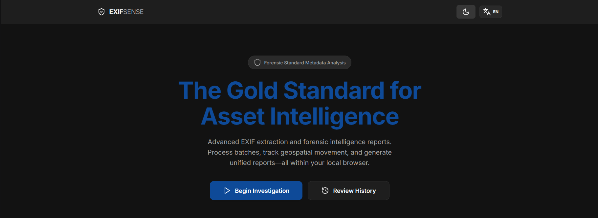
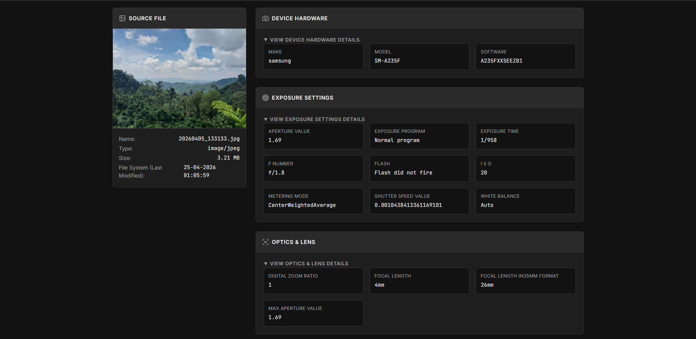
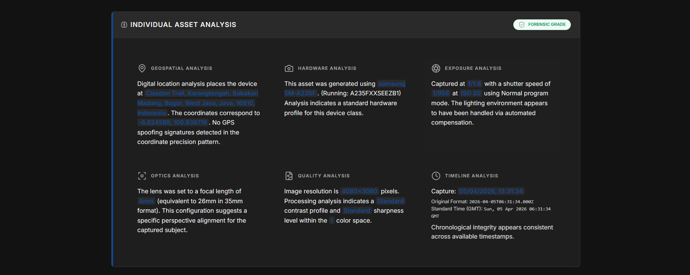
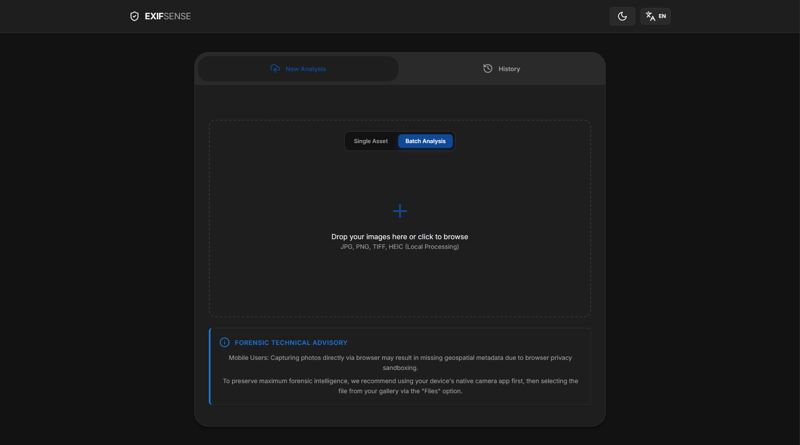
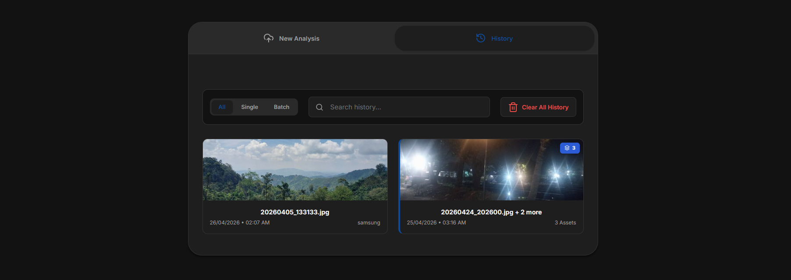

# ExifSense

## Professional Asset Intelligence and Forensic Visualization



ExifSense is an advanced, browser-native forensic platform designed to transform raw image metadata into comprehensive investigative intelligence.

> "Standard EXIF viewers provide a list of tags. ExifSense provides a narrative."

Built for forensic analysts, private investigators, and digital archeologists, ExifSense bridges the gap between technical data extraction and human-readable storytelling.

---

## Core Pillars

### 1. Absolute Privacy (Local-First)

Metadata is sensitive evidence. ExifSense ensures 100% of the extraction, processing, and narrative generation happens locally in your browser. No assets or metadata are ever uploaded to a server, maintaining an air-tight Chain of Custody and data privacy.

### 2. Forensic Storytelling (Narrative Engine)

Standard EXIF viewers provide a list of tags. ExifSense provides a narrative. Our specialized engine analyzes technical parameters (shutter speed, aperture, focal length, and geolocation) to generate human-readable expert deductions — identifying hardware consistencies, potential metadata spoofing, and optical characteristics.

### 3. Geospatial Movement Intelligence

Beyond simple pins on a map, ExifSense utilizes the OSRM (Open Source Routing Machine) to calculate realistic road-based movement between assets. It reconstructs the subject's path across the globe, revealing travel patterns that simple coordinates cannot show.

### 4. Metadata Sanitization (Privacy Shield)

ExifSense includes a dedicated metadata removal workflow. Analysts can selectively strip specific EXIF categories — or perform a full wipe — and download a forensically clean copy of the asset without altering the original.

---

## Key Features

### Advanced Forensic Extraction

* **Hardware Profiling**: Comprehensive analysis of technical device signatures, including manufacturer (Make), specific device model, and firmware/software versions used to capture the asset.
* **Software Tampering Detection**: Automatically identifies post-processing signatures from known editing tools (Adobe, GIMP, Snapseed, Canva, and others), flagging potential forensic alteration.
* **Optic & Exposure Intelligence**: Deep technical extraction of internal camera settings such as Aperture (F-Stop), ISO Sensitivity, Shutter Speed, and Focal Length. The system classifies the lighting environment (Low-Light, Bright Daylight, Shallow Depth of Field) based on these parameters.
* **Chronological Verification**: Sophisticated cross-referencing between the external file system's "Last Modified" time and the internal EXIF `DateTimeOriginal` tag, detecting potential timestamp manipulation.
* **Coordinate Spoofing Detection**: Flags two classes of anomalous GPS data — Null Island coordinates (near 0°, 0°) and integer-precision coordinates — both of which commonly indicate fabricated or manually entered location data.

### Geospatial Dashboard

* **Interactive Multi-Pin Mapping**: A high-fidelity visualization layer that renders all loaded assets simultaneously. Each marker provides a high-resolution thumbnail preview and quick access to precise GPS coordinates.
* **Road-Following Path Reconstruction**: Leverages the OSRM (Open Source Routing Machine) API to calculate the most probable road-based route between a sequence of geo-tagged assets.
* **Reverse Geocoding**: Automated conversion of raw latitude/longitude coordinates into human-readable physical addresses using the Nominatim engine.
* **Live Map Highlight**: Clicking an asset in the selector panel highlights its corresponding map marker in real-time.

### Expert Analysis & Batch Intelligence

* **Cross-Asset Batch Correlation**: Automated logical engine that scans multiple files to identify shared technical signatures — confirming whether evidence originated from a unified source or multiple distinct operators.
* **Metadata Integrity Classification**: Classifies each asset into one of three states — **Complete** (Hardware + Timeline + Geospatial all present), **Partially Stripped** (some categories missing), or **Fully Stripped** (zero core metadata).
* **Integrity Verification Matrix**: A collapsible interactive table mapping every asset against six metadata categories, allowing immediate visual identification of sanitization patterns.
* **Hardware Comparison Table**: A side-by-side raw-value comparison of Make, Model, Software, Lens Model, Lens Make, Body Serial Number, and Lens Serial Number across all uploaded assets — enabling cross-device attribution.
* **Serial Number Cross-Reference**: Detects if multiple assets share the same physical body serial number, confirming single-device provenance.
* **Timeline Reconstruction Panel**: Sorts assets chronologically and presents per-step temporal gaps between captures (e.g., `➔ +2 min 34 sec`), exposing capture sequences and potential gaps.
* **Geospatial Reconstruction Panel**: Calculates total movement path distance and per-leg distances between consecutive geotagged captures.
* **Velocity Impossibility Guard**: Calculates travel speed between consecutive geospatial points. Exceeding 1,200 km/h triggers an automatic spoofing alert.

### Upload & Staging System

* **Three Upload Modes**: Switch between **Single** (one asset at a time), **Batch** (multi-file staging queue), and **Remove** (metadata sanitization) modes via a carousel navigator.
* **Staged File Queue**: In Batch mode, assets accumulate in a visible staging list before analysis, allowing investigators to build their evidence set incrementally.
* **Smart Deduplication**: Prevents the same file from being added to the staging queue twice.
* **Animated Loading Screen**: A visual analysis buffer screen displays during processing for a polished, professional experience.

### Asset Navigation & Filtering

* **Thumbnail Asset Selector**: A horizontal scrollable panel displays all uploaded assets as thumbnails with badge indicators for geotagged and stripped files.
* **Completeness Filter**: Three-state filter allowing investigators to view **All Assets**, **Complete** assets only (full metadata), or **Stripped** assets only (missing core metadata).
* **Dynamic Expert Panel Header**: The individual analysis panel updates its heading to reflect the currently active asset's filename.

### Scalable Internationalization (i18n)

* **Three Language Support**: Full localization across English (EN), Bahasa Indonesia (ID), and Arabic (AR) — including right-to-left (RTL) layout support.
* **Decoupled JSON Dictionary**: UI strings and forensic narratives are stored in external JSON locale files, allowing new languages without modifying core logic.
* **Seamless Real-Time Switching**: Language changes apply instantly across all dashboard components — including complex forensic narratives — without a page reload.

### Unified Reporting Suite

Generate professional, investigation-ready reports in five standardized formats:

* **PDF**: A formatted, print-ready document featuring the full forensic narrative, integrity overview, and detailed metadata tables — structured across pages with clear section headers.
* **Markdown**: A lightweight, version-control-friendly format with full narrative text and structured metadata sections, suitable for technical documentation repositories.
* **JSON**: An industry-standard structured object export containing discrete metadata categories, forensic narrative strings, cross-reference matrices (integrity verification + hardware comparison), and source details — optimized for automated parsing by other security or GIS tools.
* **CSV**: A tabular raw dataset export, tailored for spreadsheet-based correlation and auditing by data analysts.
* **Clipboard (Plain Text)**: A clean, human-readable summary of forensic narratives and key metadata, copied directly to the system clipboard for rapid sharing.

### Session Persistence & History

* **Automatic Session Saving**: Every analysis session is automatically saved to browser `localStorage` with a unique Forensic ID, preserving the evidence record between sessions.
* **History Search & Filter**: Search sessions by filename and filter by type (All / Single / Batch).
* **Session Restore**: Any past session can be reloaded into the full dashboard from the history panel.

---

## Technology Stack & Architecture

ExifSense is built with a modular vanilla architecture for maximum performance and longevity without framework overhead.

* **Core Engine**: Vanilla JavaScript (ES6+ modules) with a decoupled module system and hash-based client-side router.
* **EXIF Processing**: [Exifr](https://github.com/MikeKroz/exifr) for high-performance, multi-format metadata parsing (JPEG, TIFF, HEIC, DNG, RAW, and more).
* **Mapping**: [Leaflet.js](https://leafletjs.com/) with custom road-routing integration via OSRM and reverse geocoding via Nominatim.
* **PDF Export**: [jsPDF](https://github.com/parallax/jsPDF) with `jspdf-autotable` for structured table rendering.
* **Visual Interface**: Custom CSS system (Dark/Light theme) with a sleek, professional aesthetic.
* **Storage**: Browser-native `localStorage` for secure, zero-server session persistence and history.

---

## Usage Workflow

1. **Launch**: Open `index.html` in a modern browser.
2. **Select Mode**: Choose between Single, Batch, or Remove (sanitization) mode.
3. **Import**: Drag and drop assets into the investigation zone, or click to browse.
4. **Analyze**: Review individual forensic narratives, the cross-asset intelligence matrix, and the geospatial movement map.
5. **Export**: Download findings in PDF, Markdown, JSON, CSV, or copy to clipboard.

---

## Visual Walkthrough

### Professional Investigation Dashboard


*Detailed technical extraction and forensic intelligence narratives.*

### Individual Asset Analysis


*Focus on specific optical characteristics and geospatial context.*

### Analysis Modes

| Upload & Batch Mode | History & Persistence |
| :---: | :---: |
|  |  |

---

## Technical Security Note

ExifSense is designed for read-only forensic analysis. The **Remove Mode** sanitization feature operates on a copy of the file delivered via browser download — the original source asset is never modified. While ExifSense provides high-fidelity analysis, it should be used as a supplementary intelligence tool alongside certified hardware forensic suites for judicial proceedings.

---

## Getting Started

ExifSense is a zero-server, browser-native application. To begin:

1. **Clone or Download** the repository to your local machine.
2. **Open** `index.html` in any modern web browser (Chrome, Firefox, Edge recommended).
3. **Drag & Drop** your assets into the investigation zone.

*Note: An active internet connection is recommended for geospatial tile rendering, road-following path reconstruction, and reverse geocoding.*

## Project Structure

```text
├── index.html              # Main Entry Point
├── src/
│   ├── css/                # UI System & Styling
│   │   ├── main.css        # Global tokens, layout, loader, modals
│   │   ├── dashboard.css   # Dashboard grid & asset selector
│   │   ├── expert.css      # Expert analysis & combined intel panels
│   │   ├── history.css     # History section
│   │   ├── intro.css       # Landing / upload zone
│   │   └── modal.css       # Confirm & removal modals
│   ├── locales/            # i18n Dictionaries
│   │   ├── en.json         # English
│   │   ├── id.json         # Bahasa Indonesia
│   │   └── ar.json         # Arabic (RTL)
│   └── js/
│       ├── app.js          # Core Application Orchestrator & Router
│       ├── i18n.js         # Internationalization Engine
│       ├── mapping.js      # Geospatial, Routing & Geocoding Logic
│       ├── narratives.js   # Narrative Intelligence Engine (616 lines)
│       ├── export.js       # Multi-format Export Logic (PDF/MD/JSON/CSV/Clipboard)
│       ├── history.js      # Local Persistence & Session Management
│       ├── router.js       # Hash-based Client-Side Router
│       ├── ui.js           # UI Rendering & Asset Selector Logic
│       └── utils.js        # Shared Utilities & Sanitization Engine
└── assets/
    └── screenshots/        # README visual assets
```

## License

Distributed under the MIT License.

---

Developed for high-precision digital forensics. **Sense the data behind the pixels.**
